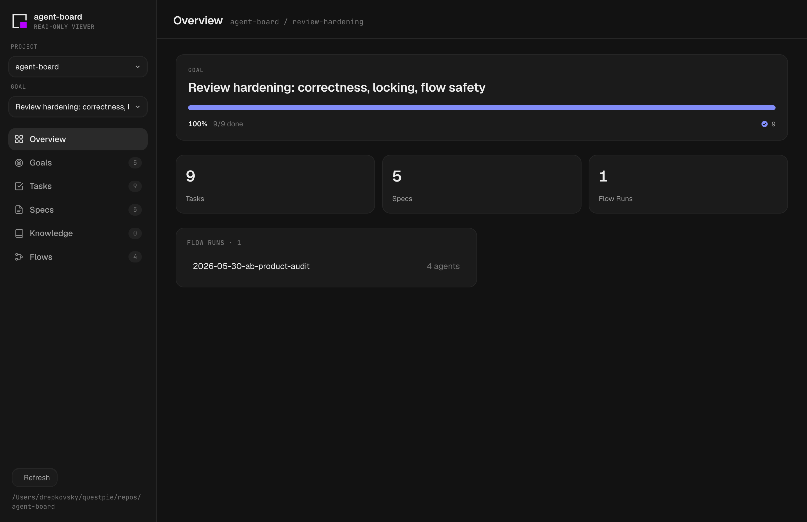
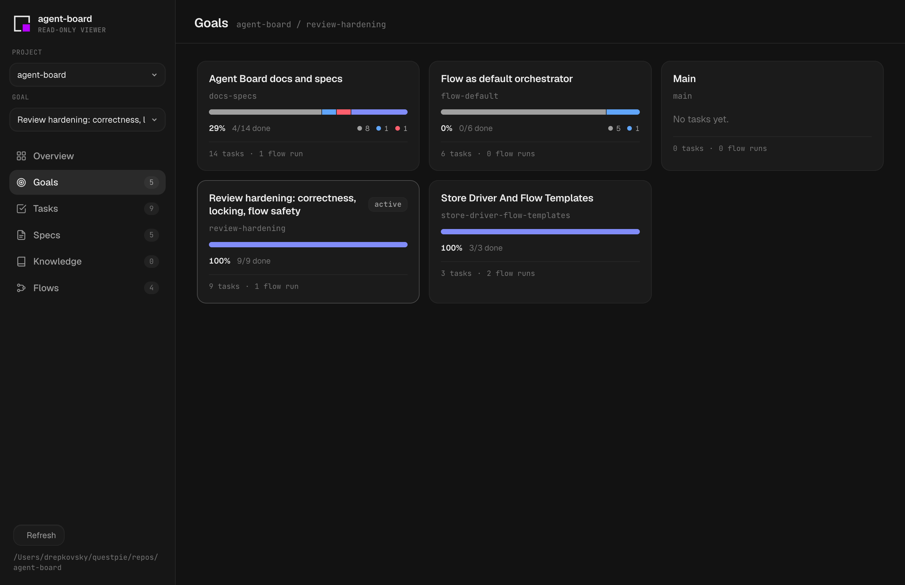
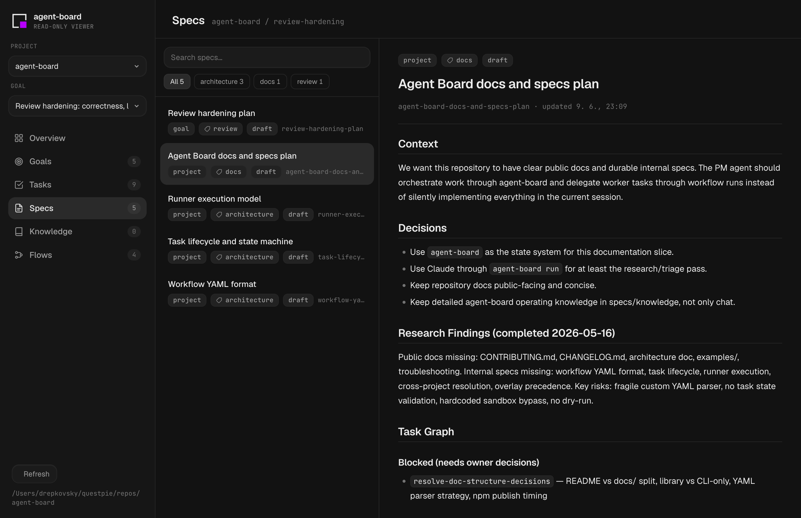
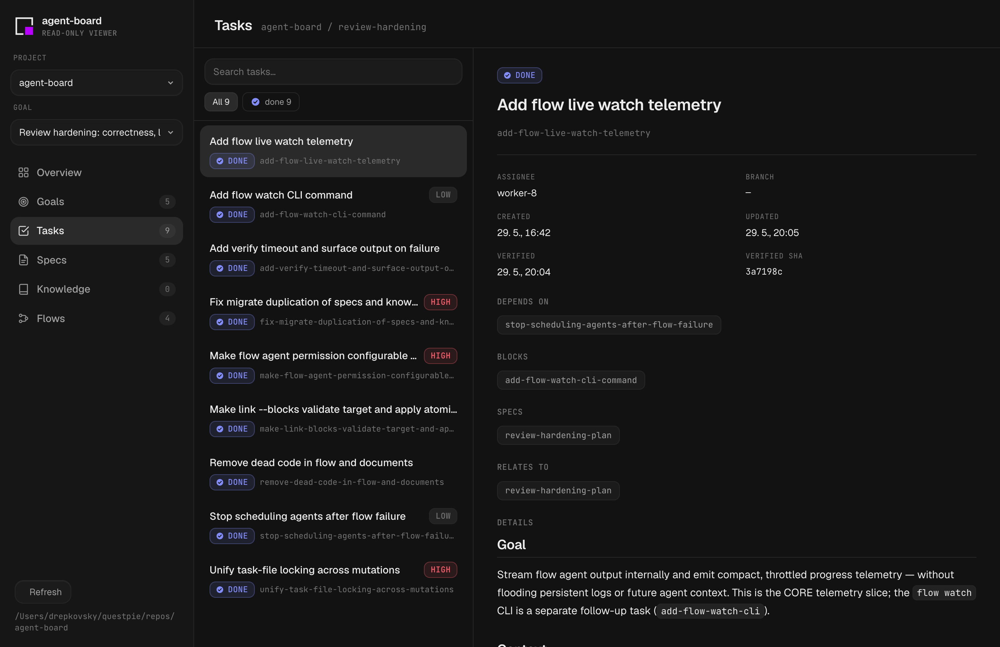
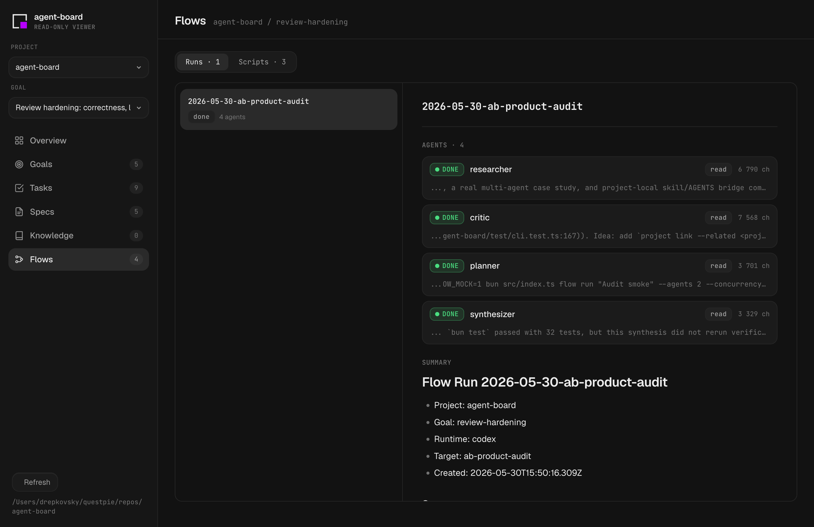

# agent-board

[](https://www.npmjs.com/package/@questpie/agent-board)
[](https://github.com/questpie/agent-board/actions/workflows/ci.yml)
[](LICENSE)

Local control plane for coding agents.

`agent-board` gives Codex, Claude Code, Cursor, and similar agents a shared Markdown task board plus a small CLI contract. Humans can keep talking in natural language; controller agents use the CLI to plan goals, split tasks, delegate workers, run flow scripts, and record evidence.



## Why

Long-running agent work fails when the plan lives only in chat. `agent-board` keeps the durable state on disk:

- `goals` focus a slice of work
- `tasks` track executable work, dependencies, blockers, assignees, and verify evidence
- `specs` hold decisions and acceptance criteria
- `knowledge` captures reusable facts and gotchas
- `flows` let a controller agent run local multi-agent fan-out, review, and synthesis

The CLI enforces the parts prose cannot: claim locking, detached-HEAD guards, dependency checks, verify evidence, and done gates.

## Install

agent-board runs on [Bun](https://bun.sh) (the CLI ships as TypeScript, no build step):

```sh
bun add -g @questpie/agent-board
agent-board skills install
```

`npm i -g @questpie/agent-board` works too, as long as Bun is on your PATH.

## Install From Source

```sh
bun install
bun link
agent-board skills install
```

`agent-board skills install` links the bundled skills into supported local runtimes:

```txt
~/.claude/skills/{agent-board,agent-board-bootstrap,agent-board-research,agent-board-spec,agent-board-safe-workflow,agent-board-flow,agent-board-implement,agent-board-worker,agent-board-grill,agent-board-maintenance,agent-board-design-wireframe,agent-board-design-review,agent-board-design-qa}
~/.agents/skills/{agent-board,agent-board-bootstrap,agent-board-research,agent-board-spec,agent-board-safe-workflow,agent-board-flow,agent-board-implement,agent-board-worker,agent-board-grill,agent-board-maintenance,agent-board-design-wireframe,agent-board-design-review,agent-board-design-qa}
~/.cursor/skills/{agent-board,agent-board-bootstrap,agent-board-research,agent-board-spec,agent-board-safe-workflow,agent-board-flow,agent-board-implement,agent-board-worker,agent-board-grill,agent-board-maintenance,agent-board-design-wireframe,agent-board-design-review,agent-board-design-qa}
```

Check links, and that the bundled skill docs still match the CLI:

```sh
agent-board skills doctor
agent-board skills check
```

`skills check` is a drift guard: it fails if a skill doc — or, in a repo checkout, this README or any `docs/*.md` — references a command or flag the CLI no longer has.

## 60-Second Quickstart

From a repository:

```sh
agent-board init --project my-project          # shared home board (~/.agent-board)
# or version the board inside the repo, alongside your code:
# agent-board init --local --project my-project  # repo board (.agent-board/)
agent-board goal new "CLI MVP" --id cli-mvp
export AGENT_BOARD_GOAL=cli-mvp

agent-board spec new "CLI MVP plan" --scope project
agent-board new "Add task CLI" --status ready --priority high
agent-board link add-task-cli --spec cli-mvp-plan

agent-board status
agent-board plan
```

A worker handles one explicit task:

```sh
agent-board claim add-task-cli --agent worker-1
agent-board progress add-task-cli "Parser path mapped; adding focused tests" --agent worker-1
agent-board verify add-task-cli
agent-board done add-task-cli
```

`progress` appends a timestamped checkpoint to the task's `## Evidence` section, so an agent can hand over intermediate findings without relying on git diff. `done` is blocked until acceptance criteria are checked and the task's `## Verify` commands pass.

## Autopilot Loop

Agent Board is meant to be the durable control plane for autopilot coding work. Chat stays the high-level controller; the board carries the facts, decisions, tasks, flow evidence, and cleanup trail:

```txt
bootstrap interview -> current research -> spec -> task graph -> flow waves -> verify/review -> knowledge -> archive/hygiene
```

When a decision depends on information that changes — frameworks, APIs, model ids, package behavior, pricing, platform rules — agents should use current official docs, repo search, web search, package metadata, or runtime discovery before writing the spec. The result should be captured in specs or knowledge, not only in chat.

Frontend/product work adds a design gate before production code:

```txt
spec -> design flow -> wireframe/design board -> design review -> implementation tasks
```

User-facing behavior adds a safe workflow gate before production code:

```txt
use cases -> scenario matrix -> failing test/replay -> implementation -> full regression
```

## Skills

Thirteen skills are bundled:

- `agent-board`: thin router/orchestrator. Chooses the right workflow, creates goals/specs/tasks, delegates, reviews evidence, and controls flow waves.
- `agent-board-bootstrap`: guided project or feature bootstrap interview with current-docs research and explicit tradeoffs.
- `agent-board-research`: read-only discovery. Turns repo/current-docs uncertainty into specs, knowledge, blockers, and concrete tasks.
- `agent-board-spec`: writes or updates specs, task graphs, dependencies, acceptance criteria, and verify blocks.
- `agent-board-safe-workflow`: TDD and no-regression workflow. Defines use-case ids, scenario matrices, stable test ids/selectors, e2e/replay gates, and verify commands before implementation.
- `agent-board-flow`: designs and runs closed-loop flow waves, including runtime/model discovery, deterministic fan-out, review, synthesis, design gates, task graphs, per-file refactor lanes, and hygiene loops.
- `agent-board-implement`: executes one explicit task id. Claims, edits, verifies, and closes the task.
- `agent-board-worker`: legacy name for the same one-task implementation workflow; kept for compatibility.
- `agent-board-grill`: adversarial challenge mode for weak assumptions, stale decisions, missing evidence, and risk review.
- `agent-board-maintenance`: read-only board hygiene. Reports stale claims/runs, broken links, archive candidates, and consolidation candidates before cleanup.
- `agent-board-design-wireframe`: authors an HTML-mockup wireframe (design board) — zero-build React-UMD + Babel, a window-globals design kit, and a Figma-like canvas of device-sized artboards. Import with `agent-board wireframe import`, then preview through `agent-board web`.
- `agent-board-design-review`: read-only critique of a wireframe against its spec — screenshot and inspect each artboard, then file concrete, spec-linked findings.
- `agent-board-design-qa`: measures the IMPLEMENTED, running UI instead of eyeballing a screenshot — a portable DOM geometry scan (overflow, truncation, misalignment, tap targets), design-token and contrast checks, an optional reference pixel-diff, and a vision judge only for the residual. Runs through whatever browser/preview tools the harness already exposes.

The split keeps hot skill context small: the router does not carry bootstrap, worker, or hygiene detail; implement workers do not choose the roadmap; and the design trio separates authoring a mockup (wireframe), critiquing it (review), and measuring the built UI (design-qa).

## Optional Flows

`agent-board flow` is agent-facing. The human describes desired work in natural language; the controller agent can create and edit a workflow script, summarize the phases, then run it after approval or explicit go-ahead.

Flows call no model API directly. Each agent in a flow is a locally installed coding agent spawned over the Agent Client Protocol (via [spawn-agent](https://www.npmjs.com/package/spawn-agent)). Pick it with `--runtime codex|claude|cursor|copilot|gemini|opencode|droid|pi` (default `codex`); the matching CLI must be installed and logged in on your machine — flows reuse its auth, no extra API keys. See [Flows: Prerequisites](docs/flows.md#prerequisites).

Discover what this machine can run before choosing:

```sh
agent-board flow runtimes
agent-board flow models --runtime codex
agent-board flow run audit --input "Audit deploy pipeline" --model <model>
```

Model discovery is best-effort through ACP config options. If a runtime does not expose a model selector, agent-board says so instead of inventing model ids; use that runtime's official docs.

Quick read-only fan-out:

```sh
agent-board flow run "Find the highest-risk missing tests" --agents 3 --concurrency 3
```

Agent-written reusable flow:

```sh
agent-board flow new audit --template review
agent-board flow cat audit
agent-board flow write audit --from ./audit-flow.mjs
agent-board flow run audit --input "Audit deploy pipeline" --task deploy-audit
agent-board flow show <run-id>
agent-board flow watch <run-id>     # read-only follower for the same live progress stream
```

Templates: `default`, `feature`, `review`, `fix`, `design`, `task-graph`, `refactor`, `hygiene`, `grill`, `safe-workflow`.

`flow run` prints the run id immediately and renders live per-agent progress by default. Use `--no-watch` when another terminal will follow the run with `flow watch`.
The per-agent inactivity watchdog defaults to 120m. Long reviews are allowed to
keep running while thinking/tool/runtime activity arrives; heartbeats distinguish
active runtime events from a quiet stream that is still within the watchdog
window.

Codex flows default to `--codex-mcp isolated`: subagents get a generated
`CODEX_HOME` with Codex auth copied over, but without your global
`mcp_servers`, so macOS should not repeatedly prompt for `Codex MCP
Credentials`. Use `--codex-mcp inherit` only when the flow needs your normal
Codex MCP integrations.

For larger jobs, flow scripts can export `meta`, run staged `pipeline(...)`
work, label agents by `phase`, and request validated structured JSON with
`agent(prompt, { schema })`. The generated `task-graph` and `refactor`
templates are designed for deterministic fan-out: they split explicit lanes or
file paths into up to 30 read-only agents, synthesize dependencies and review
gates, then leave implementation decisions with the controller.

Flow runs write:

```txt
summary.md        # read this first
agents/*.md       # per-agent details
events.jsonl      # compact lifecycle metadata
diagnostics.jsonl # filtered runtime issues only
```

Raw Codex/ACP stderr is quiet by default; use `--verbose` only when debugging the runtime.
For macOS Keychain stability with Codex flows, agent-board runs the bundled
native `codex-acp` binary directly when it is available. Set
`AGENT_BOARD_CODEX_ACP_BIN` only when you need to pin a different ACP executable.

## Maintenance

Use the read-only maintenance report before manual cleanup, retry planning, or
spec/knowledge consolidation. Prefer archiving over deleting when a record is
obsolete but still useful history:

```sh
agent-board maintenance
agent-board maintenance --stale-after 7d
agent-board maintenance --json
agent-board archive list
agent-board archive spec old-plan --reason "Consolidated into architecture-plan" --superseded-by spec:project/architecture-plan
agent-board archive flow-run 2026-06-10-stale-flow --reason "Superseded by retry"
agent-board archive restore spec old-plan
```

The report flags stale claims, stale or failed flow runs, broken task/spec links,
and duplicate or template specs/knowledge. It never deletes run artifacts,
retries flows, rewrites docs, or changes task state.

Archived tasks/specs/knowledge are hidden from default lists and status views; use `tasks --archived`, `spec list --archived`, `knowledge list --archived`, or `archive list` to inspect them. Flow-run archives are marker files beside the run artifacts, not deletions.

## Web Viewer

`agent-board web` starts a local, read-only viewer for the board. No build step and no database: it serves a small JSON API over the same board the CLI reads, plus a single-page UI styled with the QUESTPIE design system. The browser opens automatically.

```sh
agent-board web                 # opens http://127.0.0.1:4317
agent-board web --port 8080     # pick a port
agent-board web --no-open       # do not open a browser
```

Browse goals, tasks, specs, knowledge, wireframes, and flow runs from any registered project. Switch project and goal from the sidebar; the Overview adapts to each goal and hides empty sections.

- **Goals** show progress and a status breakdown at a glance. Selecting one opens its Overview.
- **Tasks** render the full graph: status, priority, dependencies, verify evidence, and the Markdown body.
- **Specs and knowledge** filter by category (set with `spec new --category`, `spec categorize`, or the knowledge equivalents).
- **Wireframes** serve imported HTML design-board bundles in an iframe, so live mockups can be reviewed next to their specs without a project-specific preview script.
- **Flow runs** show agent output, the run summary, and a timeline. Running waves poll automatically.

Every tab is deep-linkable (for example `#tasks/<id>` or `#flows/<run-id>`), so a link to a specific task or run is shareable.

<table>
  <tr>
    <td width="50%"></td>
    <td width="50%"></td>
  </tr>
  <tr>
    <td width="50%"></td>
    <td width="50%"></td>
  </tr>
</table>

The viewer is read-only by design: it reflects board state, it never mutates it.

## Share

`agent-board share` publishes a single artifact — a design, spec, task, or knowledge note — as a public link, so you can send it to someone who has neither the repo nor the CLI. The unit is one artifact (not the whole board), which keeps redaction trivial: you share exactly the file you pick.

```sh
agent-board share design <id>       # a wireframe, flattened to one self-contained page
agent-board share spec <id>         # spec / task / knowledge render as Markdown
agent-board share task <id> --open  # also open the link in a browser
agent-board share list              # links published from this project
agent-board share rm design <id>    # delete a share and its backing gist
```

Each share is stored as a **secret GitHub gist** (created through your existing `gh` auth) and rendered by a small static viewer. A design's HTML bundle is inlined into one file — local stylesheets, scripts, images, and `url(...)` assets become inline content and data URLs, while CDN/absolute references are left alone — so the recipient sees the mockup exactly as the board does, with nothing to install. Re-running `share` on the same artifact updates the same gist, so the URL stays stable.

The web viewer carries the same action: every task, spec, knowledge, and design detail has a **Share** button that posts to a localhost-only endpoint and shows the link inline, so you can publish without leaving the board.

Setup is one-time: authenticate `gh` with the `gist` scope (`gh auth login`), and enable GitHub Pages for the viewer (served from `docs/share`). Until Pages is live the command also prints the raw gist URL as a fallback. Point shares at a different viewer with `AGENT_BOARD_SHARE_VIEWER`.

A secret gist is link-private, not access-controlled: anyone with the URL can open it, and it lives on github.com. That fits "send this to a colleague"; it is not a substitute for real authentication.

## Concepts

A board lives in one of two places:

- **Home (default):** the shared `~/.agent-board`, multiplexing many repos by path via a registry. Keeps board state out of source control so parallel agents and worktrees never collide on it.
- **Local:** a single-project `.agent-board/` inside the repo (`agent-board init --local`), git-versioned with your code. Discovered by walking up from the working directory — no registry or env needed, and `project.json` stores no absolute paths, so it stays portable across clones.

Linked git worktrees resolve to their main checkout's project in both modes, so commands work from a worktree without `--project` or env overrides — while git operations still target the worktree itself.

Move an existing board between modes with `agent-board relocate --to local|home`. Within either, tasks belong to goals, and specs/knowledge/wireframes support global, project, and goal overlays. A local board stores global/project specs, knowledge, and wireframes in one flat repo directory, so default lists show that directory once. When moving from home to local, shared home global specs/knowledge/wireframes are left in the home board and the CLI warns because the relocated repo board will not see them by default.

`agent-board goal use <id>` changes the shared human default in `project.json`. Agents and parallel runs should pin work with `--goal <id>` or `AGENT_BOARD_GOAL=<id>` instead; non-interactive `goal use` requires `--force` and refuses to switch away from a goal with active work.

When a command runs inside a repo whose `CLAUDE.md`/`AGENTS.md` don't mention agent-board, the CLI prints a one-line tip. Run `agent-board nudge` to add a managed block that points agents at the board (idempotent, removable with `--remove`); the CLI never edits those files on its own.

Agents should prefer explicit subcommands such as `task cat/write`, `spec cat/write`, `knowledge cat/write`, and `flow cat/write`; filesystem paths are a convenience of the default local driver.

Read the deeper docs:

- [Concepts](docs/concepts.md)
- [Flows](docs/flows.md)
- [Storage Drivers](docs/storage-adapters.md)
- [CLI Reference](docs/cli-reference.md)
- [Changelog](CHANGELOG.md)
- [Execution Contract RFC](docs/internal/rfc-execution-contract.md) (design history)

## Development

```sh
bun install
bun run check-types
bun test
bun src/index.ts skills check
```

CI runs the same four checks on every push and pull request.

The tests cover frontmatter parsing, task graph links, overlays, git state detection, verify gates, claim guards, atomic writes, concurrent-claim locking, global skill install, related project planning, migration, mocked flow runs, local/home boards, board relocation, skill/CLI drift detection, and the web viewer.

## License

MIT
