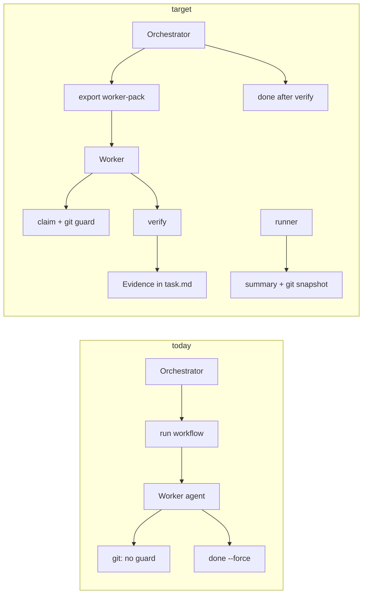

# Research brief: agent-board execution contract

**Source:** Real usage session orchestrating type-flow remediation on `questpie-cms` (May 2026)  
**Audience:** Claude / PM — research & planning for `agent-board` product improvements  
**Repo analyzed:** `/Users/drepkovsky/questpie/repos/agent-board` (v0.1.0)

---

## 1. Executive summary

We used `agent-board` to orchestrate a **5-sprint, 28-task** remediation (`questpie-type-flow-strict`) across framework, autopilot, admin, and AI packages. The board **successfully preserved plan, dependencies, and done-state outside chat**, but **failed to prevent common agent execution failures**: detached HEAD commits, `--force done` without evidence, subagents ignoring board/skills, and no objective verify gate.

**Product thesis:** agent-board is strong as **memory + task graph + workflow runner**. It is weak as **execution contract** (git, verify, evidence, agent prompt export). Closing that gap has highest ROI for multi-agent / Cursor workflows.

**Integration thesis (critical):** We do **not** primarily integrate via MCP or ad-hoc CLI docs. We integrate via **Skills** — the same mechanism Cursor, Claude Code, and Codex agents already load at session start. If the skill is missing, wrong path, or too vague, **the board is ignored** regardless of how good the CLI is. **Skills-first, CLI enforces.**

---

## 1b. Skills-first model (Cursor + Claude + agents)

### What we actually use today

| Layer | Role | Where it lives |
|-------|------|----------------|
| **Skills** | Agent behavior contract (orchestrator vs worker, claim, verify) | Bundled in `src/skills.ts` → installed by `agent-board skills install` |
| **Workflows** | Multi-step prompts + `skills: [agent-board]` per step | `~/.agent-board/workflows/*.yml`, default `dev` / `research` / `validate` |
| **CLI** | State CRUD, run launcher, plan/status | `agent-board` binary |
| **Board files** | Tasks, specs, knowledge, runs | `~/.agent-board/projects/...` |

Workflows already declare skills on every step (`src/skills.ts` L4, L19, L30…). `renderStepGuidance()` in `src/workflow.ts` lists recommended skills in the **run prompt** — but the agent only follows them if the skill is **installed and triggered** in that environment.

### Current skill bundle (bundled in repo)

| Skill file (generated) | Purpose |
|------------------------|---------|
| `SKILL.md` | Main agent-board loop, orchestrator default |
| `AGENTS.md` | Short rules variant |
| `references/pm-orchestrator.md` | PM: plan, delegate, don't implement |
| `references/task-workflow.md` | Worker: claim → implement → verify → done |
| `references/research-workflow.md` | Discovery → spec → tasks |
| `references/review-workflow.md` | Review runs, follow-ups |
| `references/config.md` | Workspace layout, init |

### Install paths today vs what we need

| Agent runtime | Installed today? | Path |
|---------------|------------------|------|
| Claude Code | ✅ | `~/.claude/skills/agent-board` |
| Generic agents | ✅ | `~/.agents/skills/agent-board` |
| **Cursor (Composer / subagents)** | ❌ | Should be `~/.cursor/skills-cursor/agent-board` |
| Project-local (optional) | ❌ | `.cursor/skills/agent-board` or repo `AGENTS.md` pointer |

**Session failure mode:** Cursor subagents never loaded the skill → committed on detached HEAD, skipped `claim`, used `--force done`. Parent had skill (user attached `agent-board` manually); workers did not.

### Design principle: Skills teach, CLI enforces

| Concern | Skill (soft) | CLI (hard) |
|---------|--------------|------------|
| Checkout branch before commit | Worker skill checklist | `git.ts` guard on `claim`/`run` |
| Claim before edit | task-workflow.md | `claimTask()` rejects wrong status |
| Verify before done | task-workflow.md | `verify.ts` + `done` gate |
| Orchestrator don't implement | pm-orchestrator.md | (optional) workflow role metadata |
| Export full context | worker skill says "run export" | `agent-board export <task>` |

**Both layers required.** Skill alone = ignored under multitask pressure. CLI alone = agent fights errors without understanding why.

### Recommended skill split (P0 for Cursor/Claude)

Instead of one monolithic `agent-board` skill, ship **composable skills** (all installed together):

#### `agent-board` (orchestrator — default)
- Triggers: `agent-board`, `sprint`, `plan`, `goal`, `delegate`, `multitask`
- Mode: **ORCHESTRATOR ONLY**
- Actions: `status`, `plan`, `new`, `link`, `run`, `export`, inspect `runs`/`logs`
- Forbidden: edit `src/` unless user explicitly switches mode

#### `agent-board-worker` (implementation)
- Triggers: `claim`, `implement`, `fix task`, `worker mode`
- Mode: **WORKER**
- Mandatory sequence:
  1. `git checkout <task.branch>` (from task frontmatter)
  2. `agent-board claim <id> --agent <name>`
  3. Read `agent-board export <id>` output
  4. Implement
  5. `agent-board verify <id>`
  6. `agent-board review <id>` or orchestrator calls `done`

#### `agent-board-research` (read-only)
- Triggers: `research`, `audit`, `discover`, `MVP evaluation`
- Mode: **RESEARCH**
- Forbidden: commits unless user approves

Each skill: **short SKILL.md** (<200 lines) + `references/` for depth. Cursor triggers matter more than length.

### Cursor-specific requirements

1. **`skills install` must link Cursor path** — `src/workspace.ts` `installGlobalSkills()`
2. **`init --cursor-skills`** — optional symlink into project `.cursor/skills/agent-board`
3. **Parent multitask prompts** should say: `Read skill agent-board-worker before any git commit`
4. **`export` output** formatted as markdown block ready to paste into subagent task (Cursor Task tool)
5. **Trigger keywords** in YAML frontmatter of each SKILL.md (Cursor skill discovery)

### Claude Code / Codex requirements

- Keep existing `~/.claude/skills` + `~/.agents/skills` install
- Workflow `skills:` arrays reference correct skill ids: `[agent-board-worker]` on implement steps, `[agent-board]` on triage steps
- `dev` workflow implement step: change from generic prompt to **"Follow agent-board-worker skill exactly"**

### AGENTS.md bridge (questpie monorepo pattern)

Project `AGENTS.md` should include one line:

```markdown
When using agent-board: load skill `agent-board` (orchestrator) or `agent-board-worker` (implementation). Run `agent-board export <task>` before coding.
```

Workflow context already pulls `repo:AGENTS.md` — this connects repo rules to board rules.

### Skills content gaps found in session (must add to references)

| Gap | Add to skill |
|-----|--------------|
| Detached HEAD | `task-workflow.md`: "Never commit on detached HEAD; run `git branch --show-current`" |
| `--force done` | "Only orchestrator; require `--reason`" |
| Manual `.private/*-prompt.md` | "Prefer `agent-board export <task>`" |
| Multitask subagents | pm-orchestrator: "Subagent prompt MUST include export output + worker skill name" |
| Verify commands | task template + worker skill: "Run task verify block before requesting done" |

### P0 implementation order (skills-first)

1. Split / extend skills in `src/skills.ts` + regenerate install bundle
2. Cursor install path + triggers
3. `export` command (skill references it)
4. `git.ts` + `verify.ts` (CLI backs skill rules)
5. Update default workflows to reference `agent-board-worker` on implement steps
6. `agent-board skills doctor` — prints which runtimes have skills linked

### Success criteria (skills lens)

Re-run 28-task session with Cursor multitask:

- [ ] Subagent prompt explicitly includes `agent-board-worker` + export block
- [ ] Zero commits without branch named in task
- [ ] Every `done` has verify evidence or logged `--force --reason`
- [ ] Parent never re-types manual prompt files in `.private/`

---

## 2. Session context (what we were doing)

### Goal
Strict TypeScript type-flow on QuestPie monorepo after merging AI execution cleanup into Autopilot refocus branch.

### Problems at start
- Autopilot used cast shims: `hookCollections`, `mirrorContext`, spread module wrappers, `ctx as any`
- Root cause in framework: `GlobalCollectionHookContext` with `Record<string, any>` while runtime sent full `AppContext`
- ~632× `Record<string, any>`, ~970× `as any` in framework scope (grep audit)

### What we shipped (questpie-cms)
| Sprint | Outcome |
|--------|---------|
| S1 | Global hooks → `AppContextBase`; remove `ctx as any` in CRUD global hooks |
| S2 | Remove autopilot shims; 0 typecheck errors; `lib/app-types.ts`, consolidated types |
| S3 | Codegen cycle fixes, `CollectionDoc<K>`, AI handler context helpers |
| S4 | Admin `query-access`, partial typed-hooks cleanup |
| S5 | Select literal unions, `jsonValueSchema`, integration tests |

**Final state:** `feat/refocus-autopilot-navigation` @ `6641d0ba+`, all typecheck/tests green, goal `questpie-type-flow-strict` 28/28 done, 3 deferred follow-ups.

### Supporting artifacts (questpie-cms)
- `.private/type-flow-audit.md` — full audit + sprint plan
- `.private/autopilot-mvp-agent-prompt.md` — next agent prompt for MVP ship evaluation

---

## 3. How we used agent-board

### Setup
```bash
agent-board goal new "questpie-type-flow-strict"
agent-board spec new "type-flow-strict-remediation"
agent-board knowledge add "..." --kind note  # pointer to audit doc
agent-board new "S1-1: ..." --status todo
agent-board link s1-1 --blocks s1-2
agent-board goal use questpie-type-flow-strict
```

### Orchestration pattern
1. Parent agent (Cursor) created goal, 28 tasks, dependency lanes S1→S2→…→S5
2. Delegated implementation to **background subagents** with sprint-scoped prompts
3. Intended: `agent-board claim` → work → verify → `done` with commit evidence
4. Actual: subagents often **skipped claim**, **committed without branch checkout**, marked **`done --force`** without filled acceptance criteria

### What worked well
| Feature | Value |
|---------|-------|
| Goal isolation | Type-flow work separate from `autopilot-issue-tracker` |
| Task dependencies | S2 blocked until S1 — correct ordering enforced in plan |
| Durable spec/knowledge | `.private/type-flow-audit.md` as source of truth |
| `plan --related` | Cross-project visibility (when configured) |
| Workflow + runs | Prompts, stdout/stderr preserved under `~/.agent-board/.../runs/` |
| Acceptance criteria guard | `done` without `--force` checks `- [ ]` in task body (`tasks.ts:128`) |

### What did not work / friction

| Problem | Impact | Root cause in agent-board |
|---------|--------|---------------------------|
| **Detached HEAD commits** | 7 sprint commits off-branch; manual merge to `feat/refocus-autopilot-navigation` | No git integration despite `repo_path` in registry |
| **Subagents ignore board** | Tasks marked done late or with `--force`; no claim | Skills not linked to `~/.cursor/skills-cursor`; no enforcement in `run` |
| **No verify gate** | "Green" claimed without consistent verify commands | `verify` not in `TaskMeta`; `done` only checks markdown checkboxes |
| **No commit evidence** | Hard to audit which task produced which commit | `writeSummary()` only logs exit codes (`runner.ts:235`) |
| **Tasks too broad** | e.g. "S4-2 entire admin views" | Generic task template; no size lint |
| **`next` too thin** | One line — insufficient for subagent prompt | `index.ts:185` — no context export |
| **Orchestrator vs worker blur** | Parent sometimes duplicated subagent investigation | Mode only in skill prose, not in CLI/prompt injection |
| **Cursor multitask delegation** | Parent must end immediately; hard to sync board mid-flight | No structured handoff back to board from subagent |

---

## 4. Code-backed gaps (agent-board repo)

| Area | File | Gap |
|------|------|-----|
| Task meta | `src/types.ts` | No `branch`, `verify`, `evidence`, `size` |
| Done gate | `src/tasks.ts` | Only `hasUncheckedCriteria()`; no verify pass; `--force` no reason |
| Runner | `src/runner.ts` | Sets `in_progress` with `force: true`; summary minimal |
| Git | — | **Module does not exist** |
| Verify | — | **Module does not exist** |
| Skills install | `src/workspace.ts:183` | Links `.claude/skills`, `.agents/skills` — **not Cursor** |
| Export | `src/index.ts` | No `export`, `worker-pack`, `next --context` |
| Claim | `src/index.ts:323` | No deps/assignee/status guards |

---

## 5. Recommended improvements (prioritized for planning)

### P0 — Execution contract (skills-first, then CLI)

**Order matters:** ship skill split + Cursor install **before** git/verify CLI — agents need to know the rules; CLI then enforces.

#### 5.0 Skills bundle (PRIMARY — `src/skills.ts`)
- Split: `agent-board` (orchestrator), `agent-board-worker`, `agent-board-research`
- Cursor install: `~/.cursor/skills-cursor/agent-board*`
- Triggers in SKILL.md frontmatter for auto-load
- Update `dev` workflow implement step → `skills: [agent-board-worker]`
- `agent-board skills doctor` — list linked paths per runtime

#### 5.1 Git module (`src/git.ts`)
- Detect detached HEAD, dirty tree, current branch
- Hook: `claim`, `run` (optional `done`)
- Task field: `branch: "feat/..."`
- Run artifact: `runs/<id>/git/{head,branch,log,diff-stat}.txt`

**Acceptance:** Worker cannot `claim` on detached HEAD without `--allow-detached`.

#### 5.2 Verify module (`src/verify.ts`)
- Task frontmatter: `verify: [{ cmd: "bun run check-types" }]`
- `agent-board verify <task>` — run cmds in `repo_path`, append to `## Evidence`
- `agent-board done <task>` — fails if verify defined and last run failed

**Acceptance:** Task with verify cannot close without pass or `--force --reason`.

#### 5.3 Agent prompt export (`src/export.ts`)
- `agent-board export <task> --format worker` — full prompt: task, specs, knowledge, branch, verify, mode=worker, git rules
- `agent-board next --context` — same for next ready task

**Acceptance:** One command replaces manual `.private/*-agent-prompt.md` for routine work.

#### 5.4 Claim guards (`src/tasks.ts`)
- Claim only from `ready`/`todo`
- All `depends_on` must be `done`
- Assignee conflict detection

#### 5.5 Cursor skill install
- `skills install` → also `~/.cursor/skills-cursor/agent-board`
- SKILL.md triggers: `agent-board`, `claim`, `sprint`, `orchestrator`

#### 5.6 Rich run summary (`src/runner.ts`)
Template sections: Outcome, Git (base/head/commits), Verify, Changed files, Follow-ups, Risks.

---

### P1 — Orchestration quality

| Item | Description |
|------|-------------|
| `--force --reason` | Audit trail when AC/verify bypassed |
| Review gate | Worker → `review`; orchestrator → `validate` workflow → `done` |
| Task templates | `--template fix|spike|research` with S/M/L size |
| `agent-board lint-tasks` | Warn on L-sized tasks without child splits |
| `project link --related` | CLI for `related_projects` in `project.json` |
| `status --oneline` | Terminal/hook friendly |
| Mode injection | `renderStepGuidance()` adds `Mode: worker|orchestrator` + forbidden actions |

---

### P2 — Platform

| Item | Description |
|------|-------------|
| MCP server | Native Cursor board read/write |
| HANDOFF.md sync | Goal-level snapshot for new chats |
| Sprint field + filter | `sprint: S4` in frontmatter |
| Shell completion | Task/run ID completion |

---

## 6. Proposed architecture



---

## 7. Suggested implementation phases (for Claude planning)

### Phase A — P0 foundation (1–2 weeks)
1. `src/git.ts` + doctor command
2. Extend `TaskMeta` + templates with branch/verify/evidence
3. `src/verify.ts` + integrate with `done`
4. `export` / `next --context`
5. Claim guards
6. Cursor skills path
7. Tests in `test/cli.test.ts` (detached HEAD fixture, verify fail blocks done)

### Phase B — P1 polish (1 week)
1. Rich summary + git snapshot in runs
2. Task templates + size lint
3. `--force --reason`
4. `status --oneline`, `project link`

### Phase C — P2 (backlog)
MCP, HANDOFF sync, completion

---

## 8. Research questions for Claude

**Skills (answer first — primary integration):**
1. One skill vs split orchestrator/worker/research — maintenance vs trigger precision?
2. Cursor: global `~/.cursor/skills-cursor` vs project `.cursor/skills` vs both?
3. Should workflow steps **require** a skill id (validate YAML on `run`)?
4. How should `export` format map to Cursor Task tool / Claude Code initial prompt?
5. Skill length vs references/ — optimal for Cursor skill discovery?

**CLI / enforcement (second):**
6. **Verify UX:** Run verify on every `done`, or only when `verify[]` non-empty?
7. **Git strictness:** Block dirty tree on `claim`, or only warn?
8. **Force policy:** Allow `--force` for orchestrator only?
9. **Evidence format:** Markdown in task vs separate `evidence.json`?
10. **Monorepo:** Verify cmds run from `repo_path` root — enough for turborepo?
11. **Backward compat:** Migration for existing tasks without `verify`/`branch`?

---

## 9. Success metrics (how we know it works)

Re-run a session like questpie type-flow (20+ tasks, 5 sprints):

| Metric | Session (actual) | Target |
|--------|------------------|--------|
| Detached HEAD commits | 7 | 0 |
| `done --force` without reason | many | 0 or logged |
| Tasks closed without verify log | most | 0 when verify defined |
| Manual prompt files needed | yes (`.private/*.md`) | optional |
| Parent re-reads full run logs | yes | no — summary sufficient |
| Time to onboard new subagent | high | `export <task>` one command |

---

## 10. Files to touch (implementation map)

```
src/skills.ts      — P0 FIRST: split skills, Cursor install, triggers, workflow skill refs
src/workspace.ts   — installGlobalSkills() + Cursor path + skills doctor
src/export.ts      — NEW (skill references this)
src/types.ts       — TaskMeta extensions (branch, verify)
src/tasks.ts       — claimTask(), done+verify, templates
src/git.ts         — NEW (CLI backs skill rules)
src/verify.ts      — NEW
src/runner.ts      — git snapshot, rich summary
src/index.ts       — doctor, export, verify, status --oneline
test/cli.test.ts   — new fixtures
docs/              — this brief + RFC execution contract
```

---

## 13. Prompt for Claude (skills-first planning)

```
Read and plan agent-board improvements with SKILLS as primary integration (Cursor + Claude + agents):

/Users/drepkovsky/questpie/repos/agent-board/docs/research-execution-contract-from-questpie-session.md

Focus §1b (Skills-first model) and §5.0 before git/verify CLI.

We use Skills — not MCP as main path. Workflows already set skills: [agent-board] per step but Cursor subagents didn't load them (wrong install path, no worker split, no export).

Deliver:
1. Skill architecture RFC: orchestrator / worker / research split, triggers, Cursor install paths
2. Updated skill content drafts (SKILL.md + references/task-workflow.md worker checklist)
3. CLI enforcement plan (git, verify) as backing layer — Phase B after skills
4. Answers to §8 research questions (skills first)
5. First PR: skills split + Cursor install + skills doctor + workflow YAML updates

Constraints: ~/.agent-board file-based, Bun/TS, backward compatible, existing test/cli.test.ts patterns
```

---

## 11. Non-goals (this research)

- Replacing git/PR workflow
- Full CI integration (verify is local agent gate, not GitHub Actions)
- Task estimation / time tracking
- Multi-user concurrent editing of board

---

## 12. Reference session commits (questpie-cms)

For traceability when testing git snapshot / evidence features:

```
e26194bd  Sprint 1 — global hook contexts
dfbf35e4  Sprint 2 — autopilot shim removal
d32c5161  Sprint 3 — framework breadth
9c780995  AI handler context
29a1cc8d  Sprint 4 — admin typed hooks
ce7a8c55  Sprint 5 — fields
6a73398e  city-portal fix
6641d0ba  AI module regen
43dad2ef  S4-3 admin client codegen
```

Branch: `feat/refocus-autopilot-navigation`

---

*Generated from Cursor orchestration session + codebase analysis of agent-board v0.1.0.*
